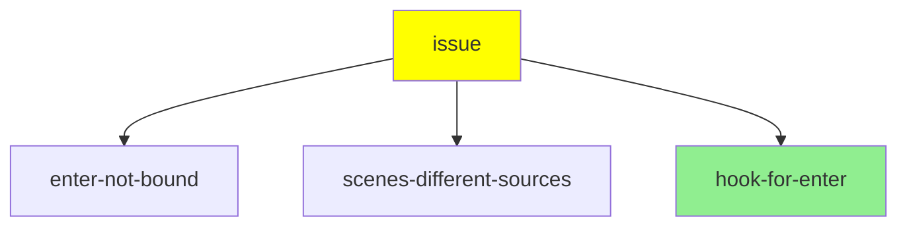
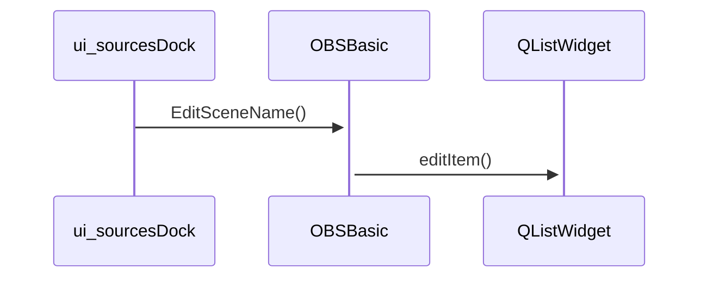
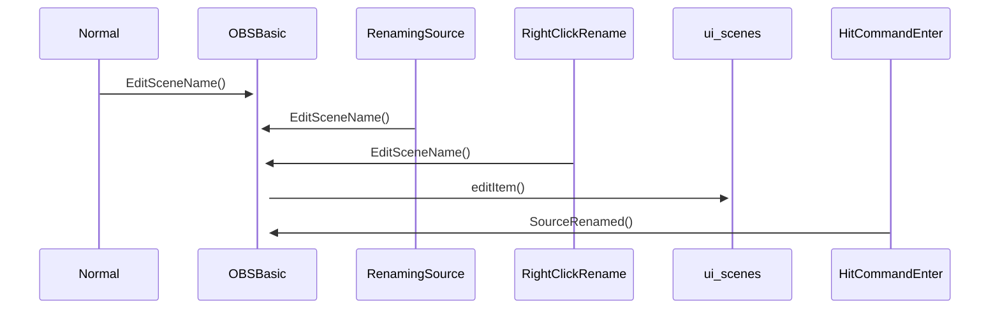
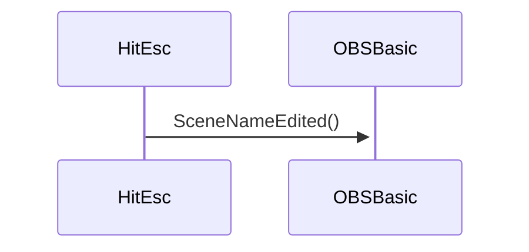

# LiveDebug - obs-studio bug #3044

[obs-studio bug # 3044](https://github.com/obsproject/obs-studio/issues/3044) Can't Rename Scenes After Creating Them.

# Preparation

Start OBS Studio, select a scene name.  Select "Rename", update name and hit enter.  Workaround is to click "command-enter".

# Issue Reproduction

Verified on downloaded 25.0.8 and source downloaded "25.0.7-467-g478f1de8-modified".

# Hypotheses


| Shortcode             | Hypothesis                                                      | Proof Point |
| --------------------- | --------------------------------------------------------------- | ----------- |
| enter-not-bound        | Enter is not bound to the UI element,  which prevents the enter being received or processed properly.                                 | inspect-code            |
| scenes-different-sources | Different behavior with scenes and sources implies different configuration | inspect-code |
| hook-for-enter | The hook for enter key `obs-basic-main.cpp:320` should be disabled to prevent re-entering of the edit stage. |

## Diagnosis flow




# Other Diagrams

Call Sequence

Editing



Hitting esc



# Narrative Summary of Issue

The root cause of this bug appears to be in [window-basic-main.cpp#L315](https://github.com/obsproject/obs-studio/blob/master/UI/window-basic-main.cpp#L315) where the UI element has
"Qt::Key_Return" added as a shortcut.  This appears to cause the Edit to be called again
when the user hits "Enter" once more.  This explanation is incomplete as it doesn't provide
for a reason for the slightly different behaviors
between the Source and Scene.

## Resolution

Created PR to remove the Hotkey binding of `Return`.  This should provide a reasonable
UI experience albeit without the ability to just hit Return when selected.

During debugging discovered 2 other classes of issues.

1. Dependencies on homebrew were not known (#22 and #3242).  These were acknowledged
and resolved by PatTheMav.
2. Older versions of macOS have a curl that returns a different return code (33) when hitting a continuation request.  This breaks the build for Mojave.  Pa

# Links, Pull Requests or other issues
 - Actual issue being debugged
   - Issue [obsproject/obs-studio#3044](https://github.com/obsproject/obs-studio/issues/3044)
   - Pull Request [obsproject/obs-studio#3271](https://github.com/obsproject/obs-studio/pull/3271)
 - Further brew deps on xz and pcre
   - Issue [obsproject/obs-deps#22](https://github.com/obsproject/obs-deps/issues/22)
 - Include webp and libtiff in brew deps for macos
   - Issue [obsproject/obs-studio#3242](https://github.com/obsproject/obs-studio/issues/3242)
   - ~~[Pull request 3243](https://github.com/obsproject/obs-studio/pull/3243)~~
- Allow repeated downloads to work
   - Issue [obsproject/obs-studio#3244](https://github.com/obsproject/obs-studio/issues/3244)


# To Do
- ~~Allow repeated downloads to work (see 20200802 notes).~~
- ~~Include webp and libtiff in brew dependencies (See PR and Issue above)~~
- Version number for git build is *not* previous release.

# Scratch Notes

## 20200810

PR was rejected for 2 reasons.
1) It was rejected since it removes a level of consistency with both obs-studio for other platforms and also there are sufficient examples of the macOS behavior of hitting enter on a list item.
2) It appears that there might be an existing bug for all the platforms associated with this flow (I suspect that) Linux has a problem to if you hit F2 while editing.

Git was an unfriendly beast, had tried following github pull request to update, but that went and changed all the commits.  Eventually followed a command line flow to add the upstream, merge it in, rebase and then push.

## 20200806

New Catalina install discovered that there are still dependencies on pcre and xz from brew.  Raised [obsstudio/obs-deps#22](https://github.com/obsproject/obs-deps/issues/22)

## 20200805

Adapted path to remove use the homebrew curl (7.71) vs Mojave curl (7.54).  This allows incremental builds to go much faster.

While identifying other hooks, discovered the following code at [window-basic-main.cpp#L315](https://github.com/obsproject/obs-studio/blob/master/UI/window-basic-main.cpp#L315):

```
    renameScene->setShortcut({Qt::Key_Return});
    renameSource->setShortcut({Qt::Key_Return});
```

The hypothesis here is that the renameSource/renameScene will hook Key_Return
into the renameSource, and so when editing the source, hitting Return wil
reenter the edit mode.  Which prevents editing occuring.

Without those lines, the behavior is consistent, but the ability to hit "Enter" to
edit is missing.  This appears to be the root cause for the issue.  Note that the
behaviors between Scene and Source is slightly different - Scene allows editing, but
hitting enter will return it to the original text.  Source will remain in edit mode.
I'm assuming that the UI definition of the two elements are slightly different.

Will work with the obs-studio devs to work out the next steps.

## 20200803

Explored a bit more of the event model - adding a few extra items for the sequence
diagram to model the interactions.

Discussions on github issues for the two existing 3242 and 3244 bugs.  3242 has
exposed a obs-deps build time dependency on brew packages that were missing in my
environment.  PatTheMav has confirmed these issues and will be generating a fix.
3244 exposed an issue with older versions of curl in macOS Mojave not being compatible with the S3 download continuation - returning 33 which triggers the build failure.
Again, PatTheMav has picked it up and is putting it on his backlog.

## 20200802

Forked and cloned to local.  Had a few issues with getting it built
*must use --recursive** for checkout.  Created  [Issue 3242](https://github.com/obsproject/obs-studio/issues/3242) and [Pull request 3243](https://github.com/obsproject/obs-studio/pull/3243).

Rebuilt with livedebug fork of obs-studio.

Found likely code source `EditSceneName` seems to be the location that is included in the context menu.  This code is in `void OBSBasic::EditSceneName()` which calls `	ui->scenes->editItem(item);`.  Debug output was confirmed after rebuild with a simple blog("here") type message.

It looks like the rebuild logic failed on "-C -" for curl commands in `CI/build-full-macos.sh`.  Filed [Issue 3244](https://github.com/obsproject/obs-studio/issues/3244), requested devs on discord give guidance on either removal, simple existence check or a full sha1/md5/sha256 check of the file before redownloading.  I expect that the xcode will allow incremental updates.

## 20200801 [Youtube](https://www.youtube.com/watch?v=VCTmF1Veodw)

Cloned obs-studio from github.  First build with `CI/full-build-macos.sh` worked.
However packaging the packaged build could not start with a libqtiff error.
No immediate documentation on how to execute (assume that OBS.app is the right
one to target).

Two issues came up with the build script.
1. The script has exit on error.  If a brew install fails, it will abort (even
  if the issue is benign).
2. Repeated building will fail on obs-deps, since curl will see the file already
existing.  At least the curl one should be fixed.
3. `./CI/full-build-macos.sh -sb` will exit with the following error for libtiff/libqtiff.dylib

```  + Skipping full build
[OBS-Studio] Creating macOS app bundle
[OBS-Studio] Preparing OBS.app bundle
  + Copy binary and plugins...
[OBS-Studio] Bundle dylibs for macOS application
  + Run dylibBundler..
Collecting dependencies...

/!\ WARNING: Dependency libtiff.5.dylib of /Users/mtp/stream/livedebug/obs-studio-123/obs-studio/build/OBS.app/Contents/PlugIns/imageformats/libqtiff.dylib not found
```

4. Brew does not include by default libtiff, webp.  There is a hard dependency on
those packages.

The issue was reproduced with a source built version `25.0.7-467-g478f1de8-modified`.
Should confirm that the build does not include 25.0.8.

Identified [obs-studio #3044](https://github.com/obsproject/obs-studio/issues/3044) as the actual issue.

Scenes accepts the enter key, but does not update.  Sources does not accept the enter key.
Failure mode is consistent.
