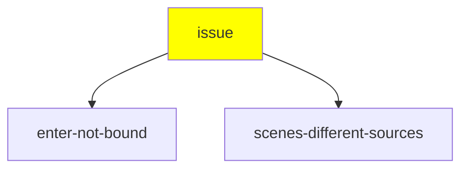
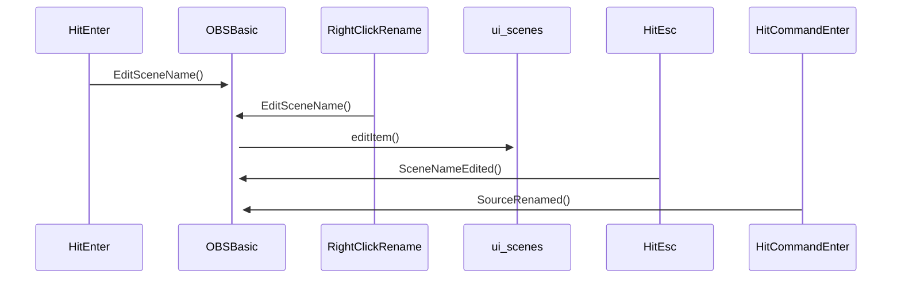

# LiveDebug - obs-studio bug #3044

[obs-studio bug # 3044](https://github.com/obsproject/obs-studio/issues/3044) Can't Rename Scenes After Creating Them.

# Preparation

Start OBS Studio, select a scene name.  Select "Rename", update name and hit enter.  Workaround is to click "command-enter".

# Issue Reproduction

Verified on downloaded 25.0.8 and source downloaded "25.0.7-467-g478f1de8-modified".

# Hypotheses


| Shortcode             | Hypothesis                                                      | Proof Point |
| --------------------- | --------------------------------------------------------------- | ----------- |
| enter-not-bound        | Enter is not bound to the UI element,  which prevents the enter being received or processed properly.                                 | inspect-code            |
| scenes-different-sources | Different behavior with scenes and sources implies different configuration | inspect-code |

## Diagnosis flow




# Other Diagrams

Call Sequence



# Narrative Summary of Issue

_**Not a Bug** Not implemented yet._

_This section summarizes the narrative of the issue.  The section should lead
in with a status that will frame this section._


# Links, Pull Requests or other issues
 - Include webp and libtiff in brew deps for macos
   - [Issue 3242](https://github.com/obsproject/obs-studio/issues/3242)
   - ~~[Pull request 3243](https://github.com/obsproject/obs-studio/pull/3243)~~
- Allow repeated downloads to work
   - [Issue 3244](https://github.com/obsproject/obs-studio/issues/3244)


# To Do
- ~~Allow repeated downloads to work (see 20200802 notes).~~
- ~~Include webp and libtiff in brew dependencies (See PR and Issue above)~~
- Version number for git build is *not* previous release.

# Scratch Notes

## 20200803

Explored a bit more of the event model - adding a few extra items for the sequence
diagram to model the interactions.  

Discussions on github issues for the two existing 3242 and 3244 bugs.  3242 has
exposed a obs-deps build time dependency on brew packages that were missing in my
environment.  PavTheMav has confirmed these issues and will be generating a fix.  
3244 exposed an issue with older versions of curl in macOS Mojave not being compatible with the S3 download continuation - returning 33 which triggers the build failure.  
Again, PavTheMav has picked it up and is putting it on his backlog.

## 20200802

Forked and cloned to local.  Had a few issues with getting it built
*must use --recursive** for checkout.  Created  [Issue 3242](https://github.com/obsproject/obs-studio/issues/3242) and [Pull request 3243](https://github.com/obsproject/obs-studio/pull/3243).

Rebuilt with livedebug fork of obs-studio.

Found likely code source `EditSceneName` seems to be the location that is included in the context menu.  This code is in `void OBSBasic::EditSceneName()` which calls `	ui->scenes->editItem(item);`.  Debug output was confirmed after rebuild with a simple blog("here") type message.

It looks like the rebuild logic failed on "-C -" for curl commands in `CI/build-full-macos.sh`.  Filed [Issue 3244](https://github.com/obsproject/obs-studio/issues/3244), requested devs on discord give guidance on either removal, simple existence check or a full sha1/md5/sha256 check of the file before redownloading.  I expect that the xcode will allow incremental updates.

## 20200801 [Youtube](https://www.youtube.com/watch?v=VCTmF1Veodw)

Cloned obs-studio from github.  First build with `CI/full-build-macos.sh` worked.
However packaging the packaged build could not start with a libqtiff error.  
No immediate documentation on how to execute (assume that OBS.app is the right
one to target).

Two issues came up with the build script.
1. The script has exit on error.  If a brew install fails, it will abort (even
  if the issue is benign).
2. Repeated building will fail on obs-deps, since curl will see the file already
existing.  At least the curl one should be fixed.
3. `./CI/full-build-macos.sh -sb` will exit with the following error for libtiff/libqtiff.dylib

```  + Skipping full build
[OBS-Studio] Creating macOS app bundle
[OBS-Studio] Preparing OBS.app bundle
  + Copy binary and plugins...
[OBS-Studio] Bundle dylibs for macOS application
  + Run dylibBundler..
Collecting dependencies...

/!\ WARNING: Dependency libtiff.5.dylib of /Users/mtp/stream/livedebug/obs-studio-123/obs-studio/build/OBS.app/Contents/PlugIns/imageformats/libqtiff.dylib not found
```

4. Brew does not include by default libtiff, webp.  There is a hard dependency on
those packages.  

The issue was reproduced with a source built version `25.0.7-467-g478f1de8-modified`.
Should confirm that the build does not include 25.0.8.

Identified [obs-studio #3044](https://github.com/obsproject/obs-studio/issues/3044) as the actual issue.

Scenes accepts the enter key, but does not update.  Sources does not accept the enter key.
Failure mode is consistent.
