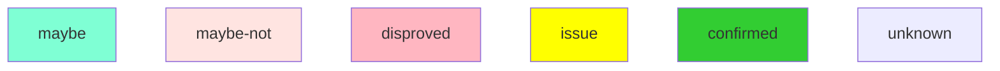
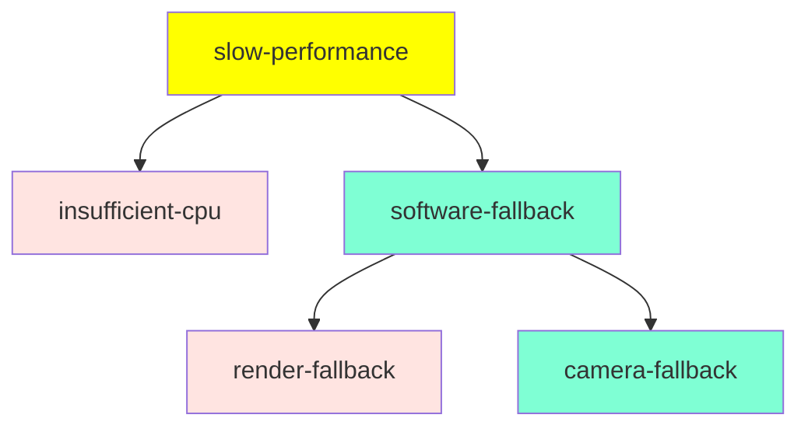
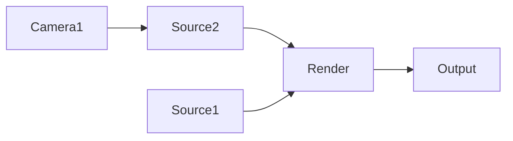

#  Elgato HD60 S+ macOS shows poor performance.

[obsproject/obs-studio#3280](https://github.com/obsproject/obs-studio/issues/3280)

When using the  Elgato HD60 S+ on macOS the performance of
the stream is horrific.  When not streaming, frame rendering takes approximately 20-30ms, and when streaming takes an extra 10-20 ms.

The performance with the HD60 S+ is *much* worse than Display Capture.  Display capture seems to be able to handle any size screen, while HD60 is unable to stream even a 720p30 screen without choking up most of the CPU.

# Preparation

With HD60 S+ connected, add a source with the HD60 S+.

# Issue Reproduction

Reproduced on 22.0.1 to 25.0.8.

# Hypotheses

_This section is a descriptive collection of ideas that need either proof or refutation.  The short code includes is used int eh diagnosis flow, the hypothesis is a description of the potential cause.  The proof point provides a method for either proving or disproving the hypothesis._

| Shortcode             | Hypothesis                                                      | Proof Point |
| --------------------- | --------------------------------------------------------------- | ----------- |
| insufficient-cpu        |   CPU is simply insufficient            |      Performance of modern CPUs should handle most compositing work with a modern OpenGL hardware                          |
| software-fallback        | There is a path which is falling back to software from hardware | Confirm CPU/GPU performance.            |
| render-fallback   | Main compositing pipeline is falling back to CPU | IIRC this is difficult a partial CPU fallback unless it is in the CGL driver.  |
| camera-fallback | The camera path is falling back to CPU conversion of full image.                     | GPU performance change when using hardware. |

## Diagnosis flow

Legend

Decision Tree


# Narrative Summary of Issue

_**Not a Bug** Not implemented yet._

_This section summarizes the narrative of the issue.  The section should lead
in with a status that will frame this section._


# Links, Pull Requests or other issues

- HD60 S+ performance bug
  - [obsproject/obs-studio#3280](https://github.com/obsproject/obs-studio/issues/3280)


# Scratch Notes

## 20200813

Behavior is consistent with software fallback somewhere in the render path.  The [General Pipeline Overview](https://obsproject.com/docs/backend-design.html#general-video-pipeline-overview) provides a bit more insight into the flow.  This is visually represented below.



Dug deeper into the code.  Relevant paths are in [av-capture.mm#L313](https://github.com/obsproject/obs-studio/blob/5f9f7166f9aa6e77562b0917a21c60b1f37cf18a/plugins/mac-avcapture/av-capture.mm#L313 ) exists a comment
```
    //TODO: uncomment VIDEO_FORMAT_NV12 and VIDEO_FORMAT_ARGB once libobs
    //      gains matching GPU conversions or a CPU fallback is implemented
```
And confirmed that the camera outputs in NV12.  Debug code in [av-capture.mm#1046](https://github.com/obsproject/obs-studio/blob/5f9f7166f9aa6e77562b0917a21c60b1f37cf18a/plugins/mac-avcapture/av-capture.mm#L1046) provides a debug information that is needed to understand the formats offered by the camera.  When not using a preset, the following output is placed in the logs

```
00:58:52.032: Video Capture Device: Capturing 'Game Capture HD60 S+ #2' (0x15000000fd9006a):
00:58:52.032:   Resolution: 1920x1080
00:58:52.032:   FPS: 60.0103 (60010321/1000000)
00:58:52.032:   Frame interval: 0.0166638 s
00:58:52.032:   Input format: Auto (actual: NV12 - 420YpCbCr8BiPlanar (420v))
00:58:52.032:   Requested color space: Auto (-1)
00:58:52.032:   Requested video range: Auto (-1)
00:58:52.032:   Using format: <AVCaptureDeviceFormat: 0x60000384f6e0> 'vide'/'420v' enc dims = 1920x1080, pres dims = 1920x108
0 { 60.01 fps }
```
