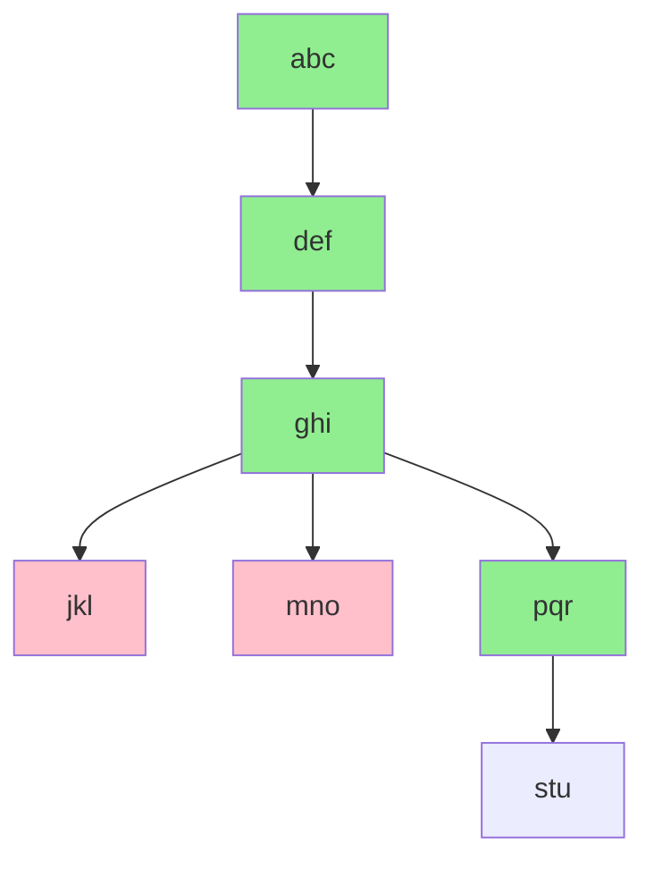

# Problem Summary

When renaming a scene, the scene name does not get updated on hitting enter.

# Preparation

_This section describes the assumed steps to reproduce the problem.  Since each livedebug session is new to the streamer, this evolves quickly as we progress._

# Issue Reproduction

Verified on downloaded 25.0.8 and source downloaded "25.0.7-467-g478f1de8-modified".

# Hypotheses

_This section is a descriptive collection of ideas that need either proof or refutation.  The short code includes is used int eh diagnosis flow, the hypothesis is a description of the potential cause.  The proof point provides a method for either proving or disproving the hypothesis._

| Shortcode             | Hypothesis                                                      | Proof Point |
| --------------------- | --------------------------------------------------------------- | ----------- |
| abc        | abc is not working                                 |             |
| def        | def is not working                          |             |
| ghi   | ghi needs a doohickey |             |
| jkl | jkl is old                     |             |
| mno   | mno is ot compiled properly      |             |

## Diagnosis flow

_This section represents a decision tree in how to debug and diagnose the problem.  
The details are captured in the the table above, and are structured in a flow
diagram below._

_This section is intended to evolve as the consideration what to consider debugging are
determined.  Each node should either be carried (default color), proven (green), or
refuted (red).  The analysis and proof or refutation should be captured below in the worklog below._



# Narrative Summary of Issue

_**Not a Bug** Not implemented yet._

_This section summarizes the narrative of the issue.  The section should lead
in with a status that will frame this section._


# Links, Pull Requests or other issues

_This section summarizes the links, pull requests and other outcomes for the debugging session._

# To Do
- Make the obs-deps smarter regarding installing the packages.
- Include webp and libtiff in brew dependencies.
- Version number for git build is *not* previous release.

# Scratch Notes

## 20200801

Cloned obs-studio from github.  First build with `CI/full-build-macos.sh` worked.
However packaging the packaged build could not start with a libqtiff error.  
No immediate documentation on how to execute (assume that OBS.app is the right
one to target).

Two issues came up with the build script.
1. The script has exit on error.  If a brew install fails, it will abort (even
  if the issue is benign).
2. Repeated building will fail on obs-deps, since curl will see the file already
existing.  At least the curl one should be fixed.
3. `./CI/full-build-macos.sh -sb` will exit with the following error for libtiff/libqtiff.dylib
```  + Skipping full build
[OBS-Studio] Creating macOS app bundle
[OBS-Studio] Preparing OBS.app bundle
  + Copy binary and plugins...
[OBS-Studio] Bundle dylibs for macOS application
  + Run dylibBundler..
Collecting dependencies...

/!\ WARNING: Dependency libtiff.5.dylib of /Users/mtp/stream/livedebug/obs-studio-123/obs-studio/build/OBS.app/Contents/PlugIns/imageformats/libqtiff.dylib not found
```
4. Brew does not include by default libtiff, webp.  There is a hard dependency on
those packages.  

The issue was reproduced with a source built version `25.0.7-467-g478f1de8-modified`.
Should confirm that the build does not include 25.0.8.
