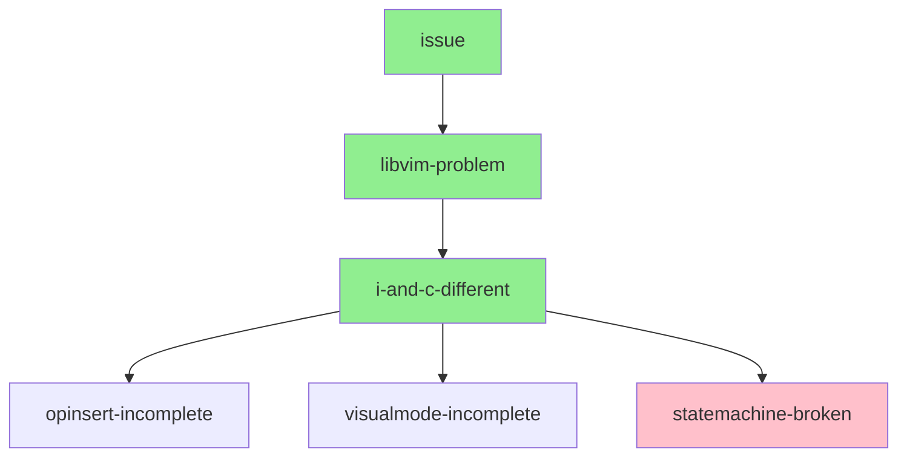
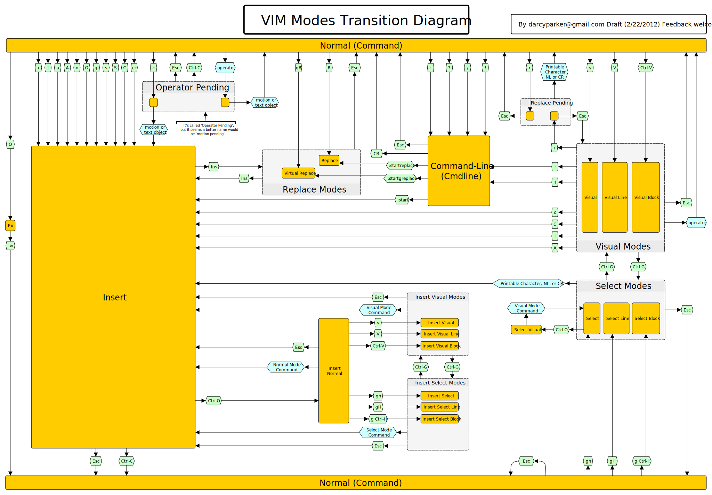

# LiveDebug - Onivim 2 #1633 - Insert doesn't work.

<https://github.com/onivim/oni2/issues/1633>

# Pull requests and commits

[Unit test updates reproducing the problem](https://github.com/onivim/libvim/pull/215)

# Problem Summary

When editing a file, the visual mode - triggered by `^V` will not actually
allow the `I` or `A` commands to operate.  However `c` does work.   

# Preparation

Onivim 2 is alpha, donateware, so building from source is the only option.  We could
request a sample build to reproduce.  However the source is available and building from
source uses esy, and so was mostly painless and worked quite well.  No particular
issues.

# Issue Reproduction

Issue reproduces with test build.  Validated correct behavior with neovim and vim.

# Hypothesis

| Shortcode             | Hypothesis                                                      |  
| --------------------- | --------------------------------------------------------------- |
| libvim-problem        | Issue is within libvim, not vim                                 |
| i-and-c-differ        | I and c have slightly different paths.                          |
| opinsert-incomplete   | OP_INSERT needs a bit more state enabled before it takes action |
| visualmode-incomplete | Visual Mode is not fully setup for deletion                     |
| statemachine-broken   | Statemachine is receiving the incorrect data to operate on      |

## Diagnosis flow

# Narrative

libvim is a fork of vim 8.0, with a onivim statemachine placed on top of it.  In this particular case the state-machine is not fully implemented

# Outcome

**Not a Bug** Not implemented yet.

# Scratch Notes

## 20200723

[bryphe](https://github.com/bryphe) commented on [pull request](https://github.com/onivim/libvim/pull/215) that the statemachine supporting `I` was incomplete.  So not a bug, not implemented :(

## 20200722

Discovered  at <https://www.reddit.com/r/vim/comments/1mcrch/vim_modes_transition_diagram/>.  
Confirms the state transitions I had debugged yesterday.

## 20200721

Not too successful.  Lots of going in and out of state machine callbacks

## 20200720

in normal.c, nv_edit, we have the code going down to the moving to begin of line (via beginline), so we should be at the right point for insertion.
Checkpoint - "I" seems to be pushing into sm_push, need to work out how it is being executed

## 20200719

`vim.h` contains OP_XYZ #defines, which map to different operators "c" is "OP_CHANGE" "I" is or "OP_INSERT".
OP_CHANGE is used in normal.c and ops.c, OP_INSERT is used in edit.c, normal.c, ops.c

OP_INSERT doesn't appear to be easily hit in the same way that OP_CHANGE is.

General logic is

-   Finish operation
-   state changes to 16

## 20200717

I & c move from state 1 (normal) to state 16 (0x10 INSERT)

## 20200716

With vim - we have `^V` `kkk` `I`  will insert at the start of the selected line.

With vim - we have ^V kkk c // will replace
With onivim - ^V kkk c // will not replace

Other notes - with change (c) we can see the editor change mode with I it does not.

Unit test MU_TEST(test_insert_block_mode) does the operations but does not check the file.

Issue is within libvim, not onivim2

Test cases confirm, creating pull request to improve unit test coverage before diving into libvim.

I and c have slightly different paths

Is this within the editor or within the libvim?
Testcases within libvim, let’s look at them when we have it building.
