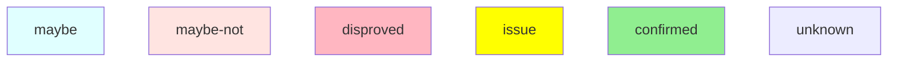
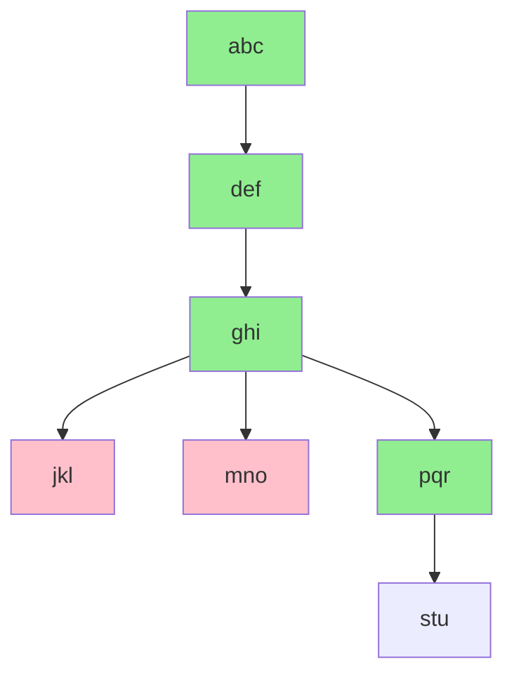

# <Problem Name>

_This section describes the actual problem being investigated.  Generally a restatement or verbatim copy of the actual bug description._

# Preparation

_This section describes the assumed steps to reproduce the problem.  Since each livedebug session is new to the streamer, this evolves quickly as we progress._

# Issue Reproduction

_This section is a descriptive overview of how to get to reproducing the problem._

# Hypotheses

_This section is a descriptive collection of ideas that need either proof or refutation.  The short code includes is used int eh diagnosis flow, the hypothesis is a description of the potential cause.  The proof point provides a method for either proving or disproving the hypothesis._

| Shortcode             | Hypothesis                                                      | Proof Point |
| --------------------- | --------------------------------------------------------------- | ----------- |
| abc        | abc is not working                                 |             |
| def        | def is not working                          |             |
| ghi   | ghi needs a doohickey |             |
| jkl | jkl is old                     |             |
| mno   | mno is ot compiled properly      |             |

## Diagnosis flow

_This section represents a decision tree in how to debug and diagnose the problem.
The details are captured in the the table above, and are structured in a flow
diagram below._

_This section is intended to evolve as the consideration what to consider debugging are
determined.  Each node should either be carried (default color), proven (green), or
refuted (red).  The analysis and proof or refutation should be captured below in the worklog below._

Legend

Decision Tree

# Narrative Summary of Issue

_**Not a Bug** Not implemented yet._

_This section summarizes the narrative of the issue.  The section should lead
in with a status that will frame this section._

# Links, Pull Requests or other issues

_This section summarizes the links, pull requests and other outcomes for the debugging session._

# Scratch Notes

_This section is the "live log" of livedebug, including the summary of each day's
activity._

## 20200723

## 20200723
